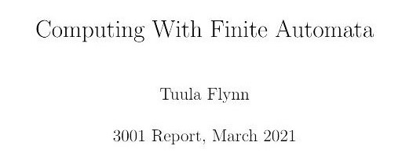

# Computing-with-Finite-Automata

My final year maths report which I wrote on finite automata in 2021. 
I researched the topic for 3 months; reading books/academic papers, going to
lectures on the subject and completing exercises. Then,
it took me 4 months to write the report alongside continued research and
other university maths work. 

## What is automata?
Automata is the plural of automaton. 
An automaton is a self-operating machine that performs a series of predetermined actions - 
almost the most basic computer! 

A finite automaton is a mathematical model
used to represent a system that can be in one of a finite number of states at 
any given time.
The predetemined actions are a set of input symbols (an input string)
which the automaton reads 
and uses to transitions between states with the aid of a transition function.
If a final state is reached, the automaton accepts the input string,
otherwise the input string is rejected. 

## To view the report [click here](https://github.com/tuulaflynn/Computing-with-Finite-Automata/blob/master/computing_with_finite_automata_report.pdf)
or [here using the relative link path](computing_with_finite_automata_report.pdf).

## Table of Contents
| Chapter   | Name                | Page    |
|----------:|---------------------|---------|
| Chapter 1 | Finite Automata     | p1-6    |
| Chapter 2 | Subset Construction | p7-9    |
| Chapter 3 | Regular Expressions | p10-16  |
| Chapter 4 | Büchi Automata      | p17-p26 |
| Chapter 5 | References          | p27     |
